Hei! Her har jeg laget en fullstack bookingapplikasjon for helsetjenester, der pasienter kan finne og booke time hos behandlere. Dette har jeg laget som et CV-prosjekt for å demonstrere mine ferdigheter innen webutvikling. Appen er laget for å fungere på alle flater, men den ser best ut på mobile enheter med skjermbredde mellom 375px - 1000px.

<h2>
<a href="https://helsebooking.onrender.com" target="_blank">🔗 Live demo</a>
</h2>

Jeg har laget testbrukere som du kan bruke. Det er bare å opprette timer, slette timer, pasienter, behandlere, endre profilbilder og klinikker, gjør som du vil. 

## 🔑 Test-brukere

| Rolle      | Epost                        | Passord   |
|------------|------------------------------|-----------|
| Behandler  | kristoffer@helsebooking.no   | Test1234  |
| Behandler  | lise@helsebooking.no         | Test1234  |
| Behandler  | tove@helsebooking.no         | Test1234  |
| Behandler  | steinar@helsebooking.no      | Test1234  |
| Behandler  | jonas@helsebooking.no        | Test1234  |
| Behandler  | morten@helsebooking.no       | Test1234  |
| Behandler  | kari@helsebooking.no         | Test1234  |
| Pasient    | anders@helsebooking.no       | Test1234  |
| Pasient    | camilla@helsebooking.no      | Test1234  |
| Pasient    | daniel@helsebooking.no       | Test1234  |
| Pasient    | emilie@helsebooking.no       | Test1234  |
| Pasient    | fredrik@helsebooking.no      | Test1234  |
| Pasient    | ingrid@helsebooking.no       | Test1234  |
| Pasient    | marius@helsebooking.no       | Test1234  |

# Skjermbilder

## 📸 App Showcase

Under har jeg tatt noen skjermbilder fra appen! Men jeg anbefaler at du logger deg inn på en av testbrukerne å klikker deg rundt selv, eller at vi sammen tar en gjennomgang! 😊

---

### 🏠 Forside / About
<div>
  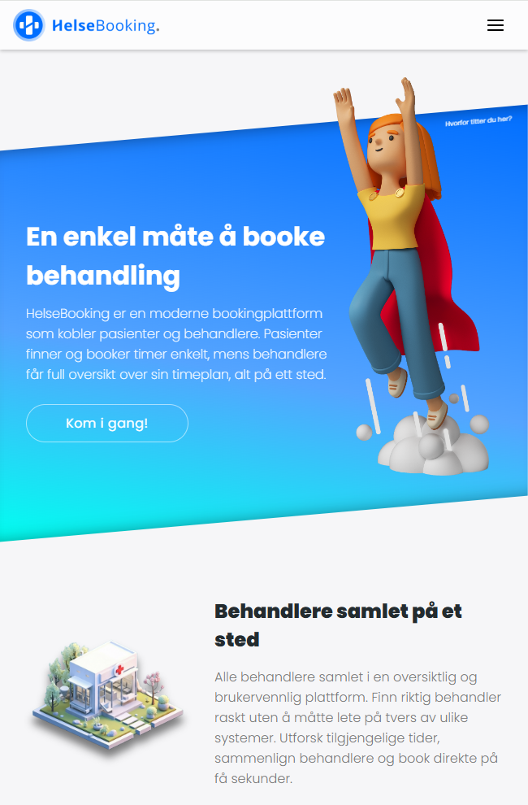
  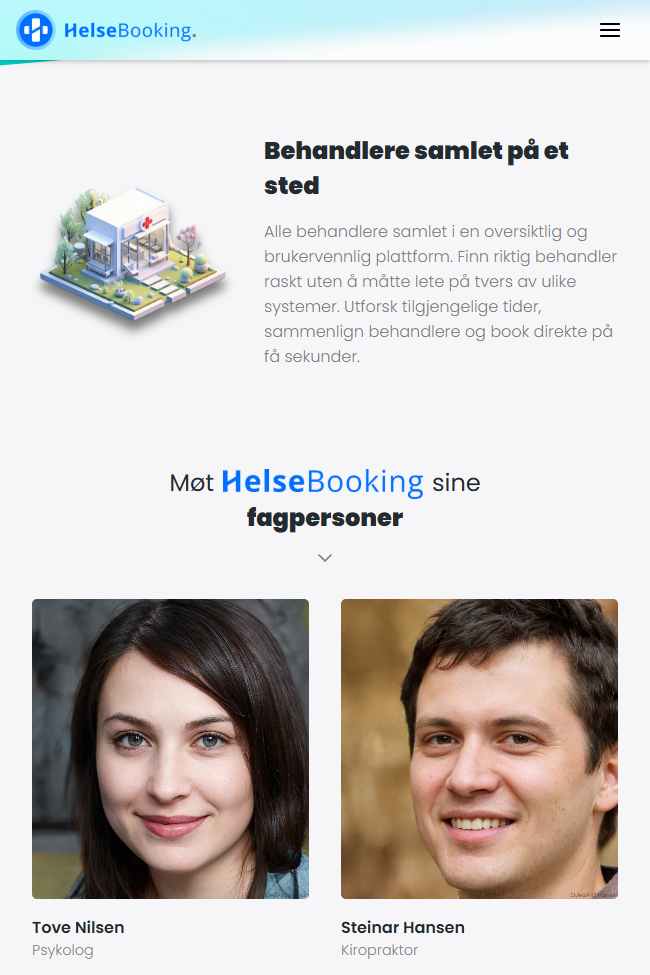
</div>
<br>
<div>
  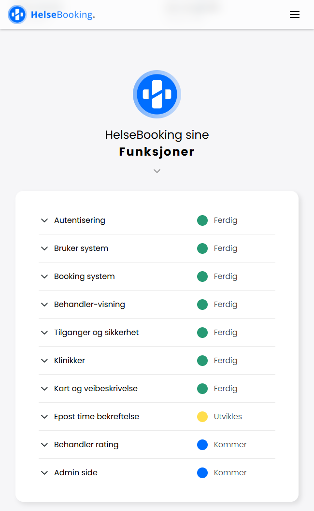
  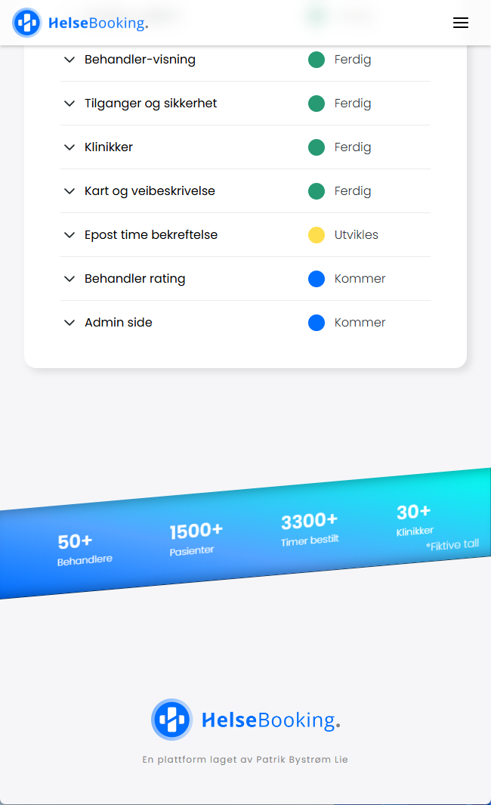
</div>

---

### 🔐 Auth (login/registrering)
<div>
  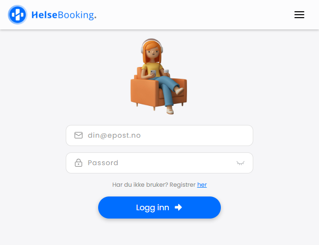
  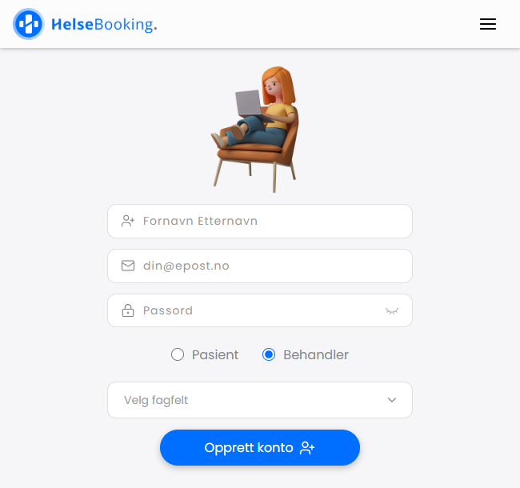
</div>


---

### 📅 Book time (pasient)
<div>
  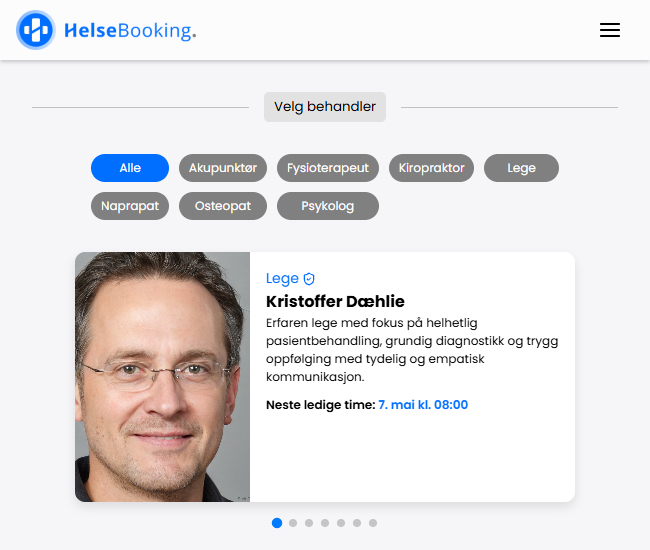
  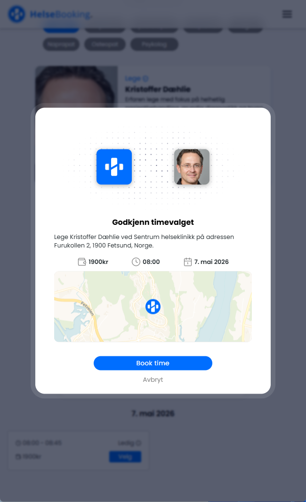
</div>

---

### 👨🏻 Mine timer (pasient)
<div>
  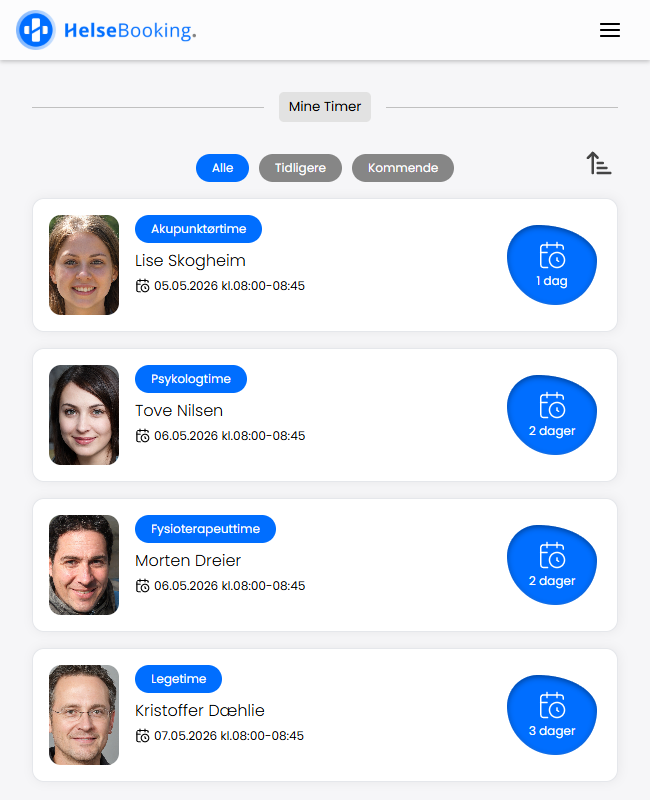
  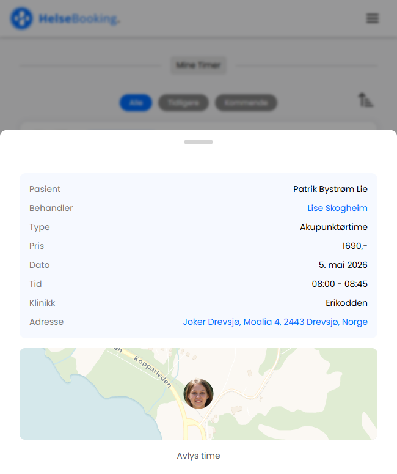
</div>

---
---

### 🏥 Klinikker (behandler)
<div>
  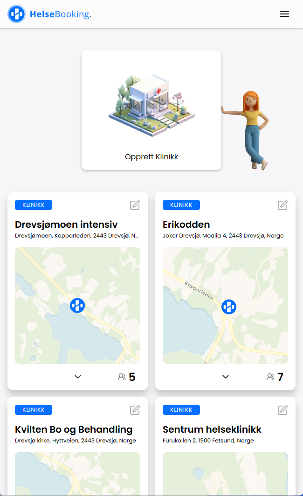
  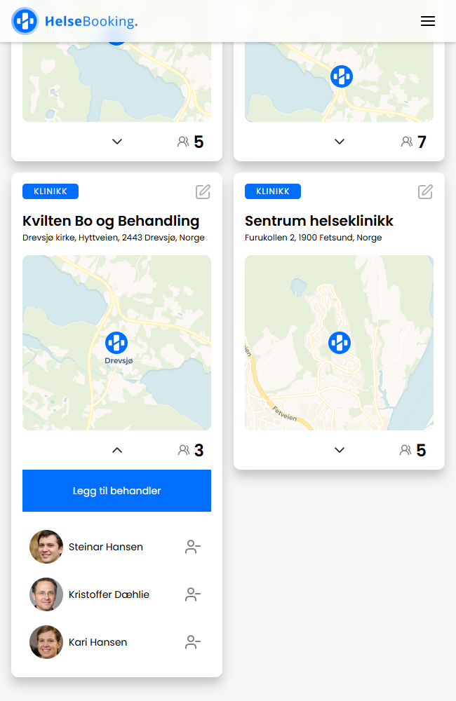
  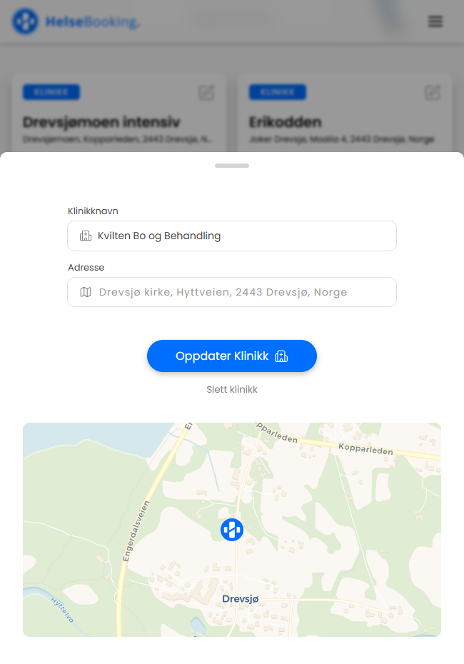
</div>

### 🩺 Min profil (behandler)
<div>
  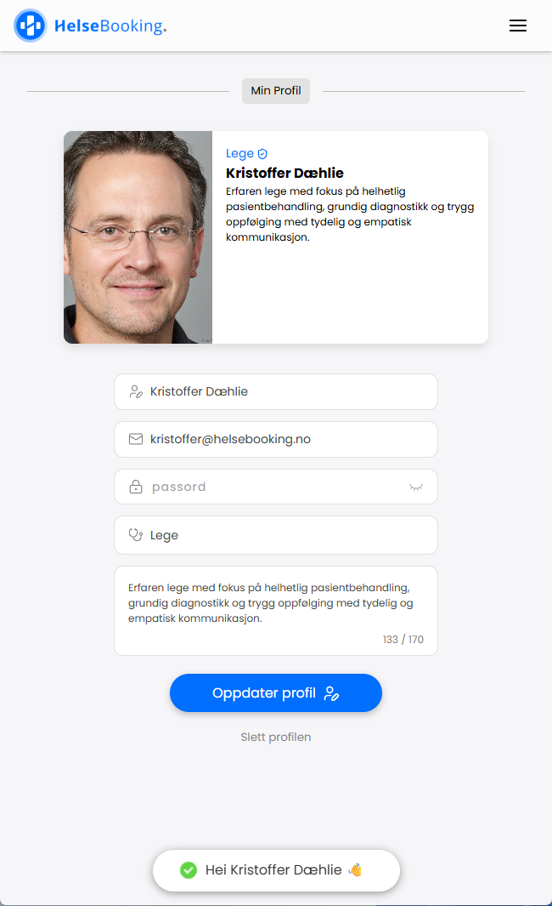
  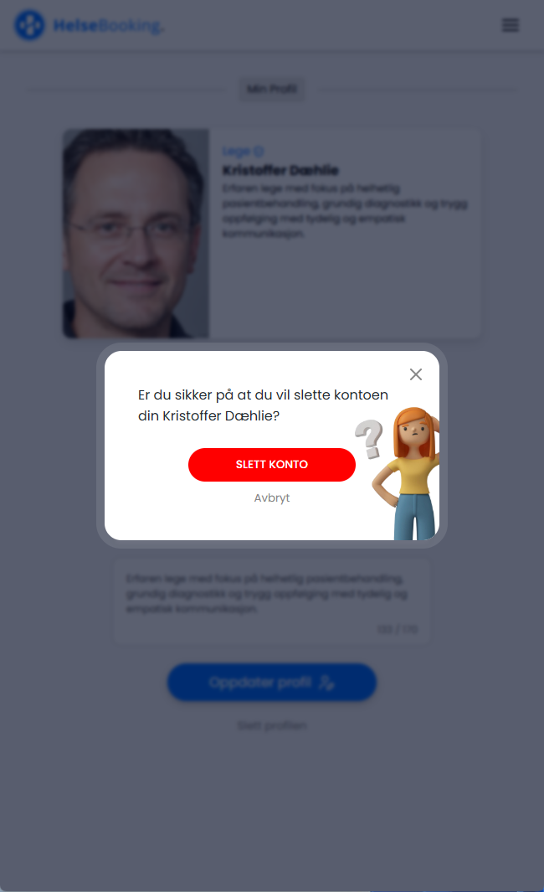
</div>

## ⭐ Funksjonalitet

**Pasient**
- Registrering og innlogging med JWT-autentisering
- Bla gjennom behandlere med Swiper-karusell
- Se behandlerprofiler med profilbilde, navn og spesialitet
- Booke ledig time med bekreftelsesmodal
- Se og avbestille egne timer med swipe-to-delete animasjon


**Behandler**
- Opprette ledige timer med dato og tidspunkt
- Se oversikt over bookede timer i kalender
- Rollebasert visning – behandlere ser andre verktøy enn pasienter
- Laste opp og slette profilbilde via Cloudinary
- Opprett og rediger klinikker og tilhørende behandlere
- Rediger timer, legg til eller fjern pasienter på timen.


**Generelt**
- Rollebasert tilgangskontroll (pasient / behandler / admin)
- Hindrer at samme time bookes flere ganger, ikke mulig å booke eller opprette timer tilbake i tid. Timer blir slettet dersom man fjerner en behandler fra en klinikk eller sletter profilen sin pasient/behandler.
- Responsivt design med animert navigasjon

---

## Tech Stack

### 💻 Frontend
| Teknologi | Bruk |
|---|---|
| React + Vite | UI-rammeverk og byggverktøy |
| React Router v7 | Klientside routing |
| Zustand | Global state management |
| Framer Motion | Animasjoner og swipe-to-delete |
| Swiper | Karusell for behandleroversikt |
| Axios | HTTP-kall mot API |
| Lucide React | Ikonbibliotek |
| Leaflet + Geoapify | Kart |

### 🗄️ Backend
| Teknologi | Bruk |
|---|---|
| Node.js + Express | API-server |
| MongoDB + Mongoose | Database og ODM |
| JWT + bcryptjs | Autentisering og passordhashing |
| Cloudinary + Multer | Bildeopplasting og lagring |
| CORS | Kryssdomene-tilgang |

### ☁️ Deploy
| Tjeneste | Bruk |
|---|---|
| Render | Hosting av frontend (Static Site) og backend (Web Service) |
| MongoDB Atlas | Skybasert database |
| Cloudinary | Bildelagring |

---

## Arkitektur

```
behandler-booking/
├── backend/
│   └── src/
│       ├── controllers/
│       ├── middleware/
│       ├── models/
│       ├── routes/
│       └── server.js
└── frontend/
    └── src/
        ├── components/
        ├── pages/
        ├── store/
        └── main.jsx
```

Frontend og backend er deployet som to separate services på Render og kommuniserer via REST API.

---

## Kom i gang lokalt

### Forutsetninger
- Node.js
- MongoDB Atlas-konto
- Cloudinary-konto

### Installasjon

```bash
# Klon repoet
git clone https://github.com/patriklie/behandler-booking.git

# Installer backend
cd behandler-booking/backend
npm install

# Installer frontend
cd ../frontend
npm install
```

### Miljøvariabler

Opprett `.env` i `backend/`-mappen:

```
MONGO_URI=din_mongodb_connection_string
JWT_SECRET=din_hemmelige_nøkkel
CLOUDINARY_URL=din_cloudinary_url
PORT=3000
NODE_ENV=development
```

Opprett `.env` i `frontend/`-mappen:

```
VITE_API_URL=http://localhost:3000
VITE_GEOAPIFY_API_KEY=din_geoapify_nøkkel
```

### Start applikasjonen

```bash
# Start backend (fra backend-mappen)
npm run dev

# Start frontend (fra frontend-mappen)
npm run dev
```

---

## 👨🏻‍💻 Utvikler

**Patrik Bystrøm Lie**
- GitHub: [@patriklie](https://github.com/patriklie)
- E-post: [patrik.lie@hotmail.com](mailto:patrik.lie@hotmail.com)