<div align="center">

</div>

# Hei 👋

### Velkommen til HelseBooking, min fullstack bookingapplikasjon for helsetjenester hvor pasienter kan finne og booke time hos behandlere.

Problemet appen løser er at mange bookingløsninger i helsebransjen er fragmenterte og lite brukervennlige. Målet med dette prosjektet var å bygge en enkel og moderne løsning der pasienter og behandlere kan samhandle sømløst i en plattform, og samtidig prøve å redusere antall klikk fra du logger inn til du har booket riktig time. Prosjektet er laget som et CV-prosjekt så jeg ville samtidig demonstrere ferdigheter innen moderne webutvikling, med fokus på brukeropplevelse, autentisering og rollebasert tilgang.

## 📋 Innhold

- [Live Demo](https://helsebooking.onrender.com)
- [Skjermbilder](#-skjermbilder-fra-appen)
- [Logo design prosess](#-logo-design) 
- [Funksjonalitet](#-funksjonalitet)
- [Tech Stack](#tech-stack)
- [Arkitektur](#️-arkitektur--systemdesign)
- [Installer lokalt](#installer-appen-lokalt)
- [Utvikler](#-utvikler)

<div align="center">

<h1><a href="https://helsebooking.onrender.com" target="_blank">⚡️ Live Demo ⚡️</a></h1>


</div>

<br>

Jeg har laget testbrukere under man kan logge på med. Med disse er det bare å opprette timer, slette timer, pasienter, behandlere, endre profilbilder og klinikker. **Logg inn og utforsk fritt** — timer og klinikker er forhåndsutfylt.

> [!TIP]
> Appen er responsiv og fungerer på alle enheter, men er optimalisert for mobil (375px – 1000px). For best opplevelse: legg til HelseBooking som PWA på mobilen.
>
> 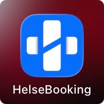


### 🔑 Test-brukere

| Rolle      | Epost                        | Passord   |
|------------|------------------------------|-----------|
| Behandler  | kristoffer@helsebooking.no   | Test1234  |
| Behandler  | lise@helsebooking.no         | Test1234  |
| Behandler  | tove@helsebooking.no         | Test1234  |
| Behandler  | steinar@helsebooking.no      | Test1234  |
| Behandler  | jonas@helsebooking.no        | Test1234  |
| Behandler  | morten@helsebooking.no       | Test1234  |
| Behandler  | kari@helsebooking.no         | Test1234  |
| Pasient    | anders@helsebooking.no       | Test1234  |
| Pasient    | camilla@helsebooking.no      | Test1234  |
| Pasient    | daniel@helsebooking.no       | Test1234  |
| Pasient    | emilie@helsebooking.no       | Test1234  |
| Pasient    | fredrik@helsebooking.no      | Test1234  |
| Pasient    | ingrid@helsebooking.no       | Test1234  |
| Pasient    | marius@helsebooking.no       | Test1234  |

<br>

# 📸 Skjermbilder fra appen

Under har jeg tatt noen skjermbilder fra appen! Men jeg anbefaler at du logger deg inn på en av testbrukerne å klikker deg rundt selv, eller at vi sammen tar en gjennomgang! 😊


## 🏠 Forside / Om

<div>
  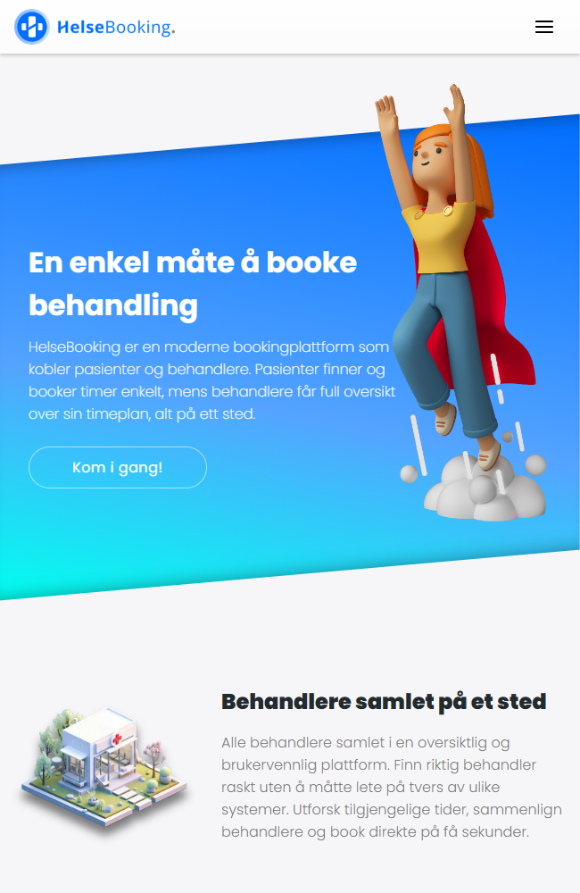
  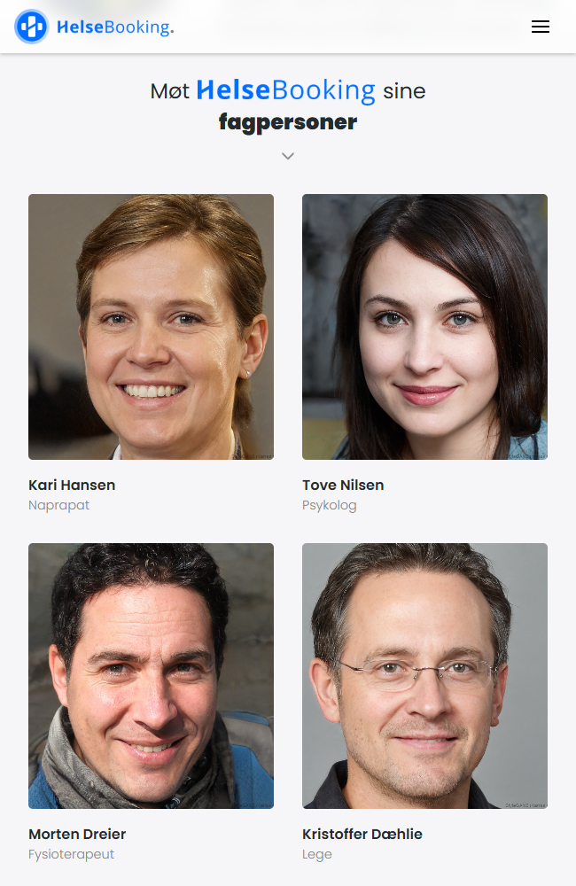
</div>
<br>
<div>
  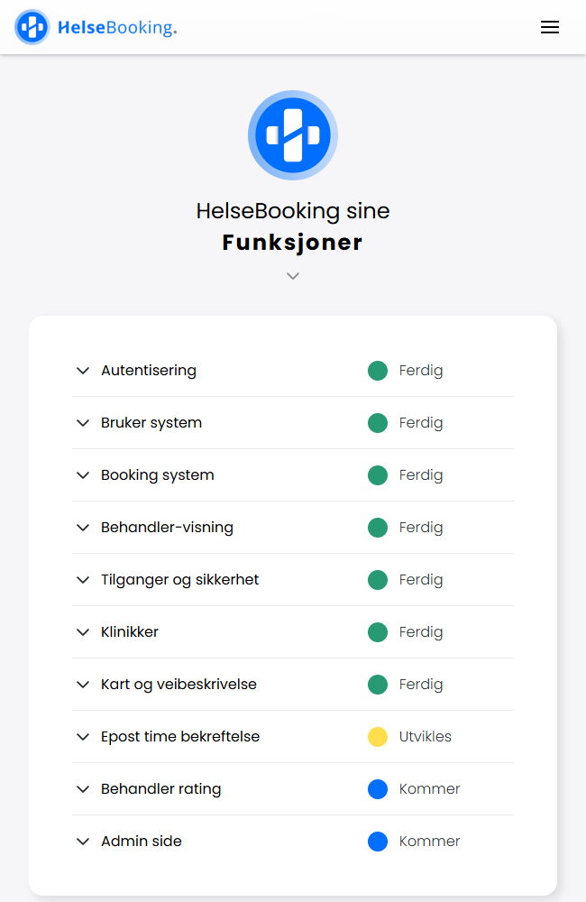
  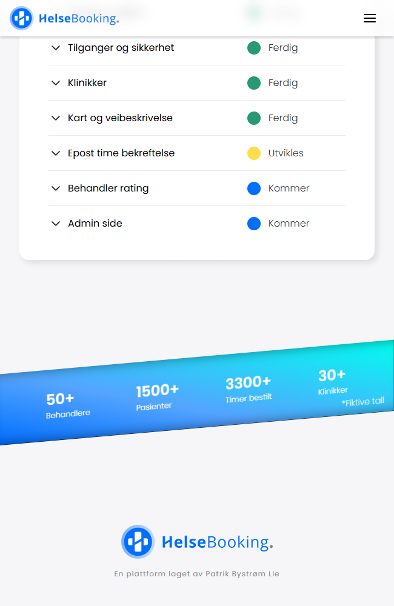
</div>

## 🔐 Auth (login/registrering)
<div>
  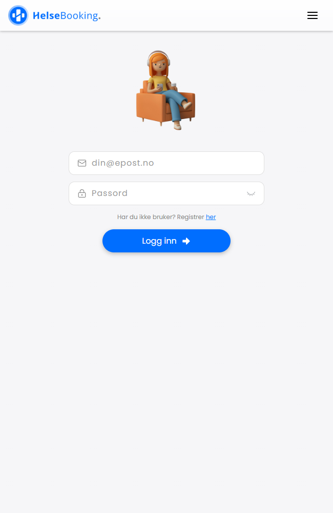
  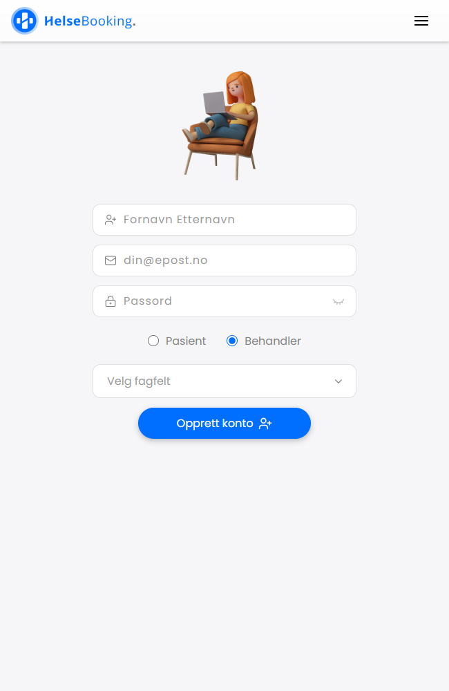
</div>

## 📅 Book time (pasient)
<div>
  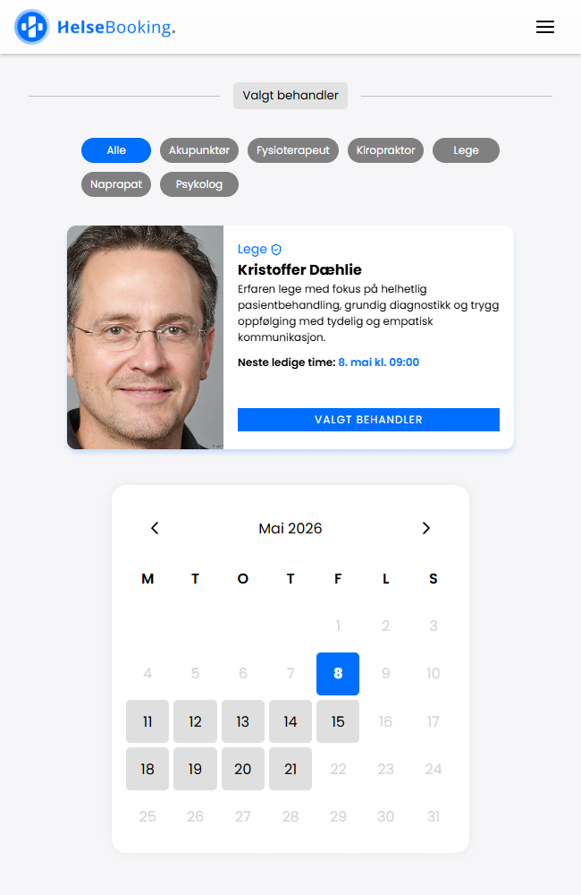
  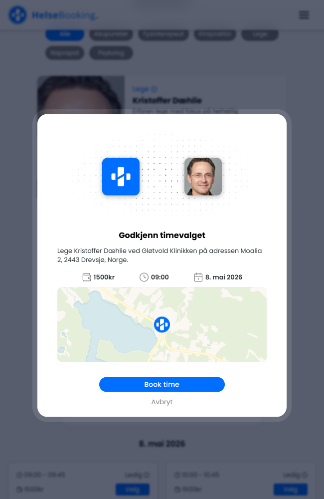
</div>

## 👨🏻 Mine timer (pasient)
<div>
  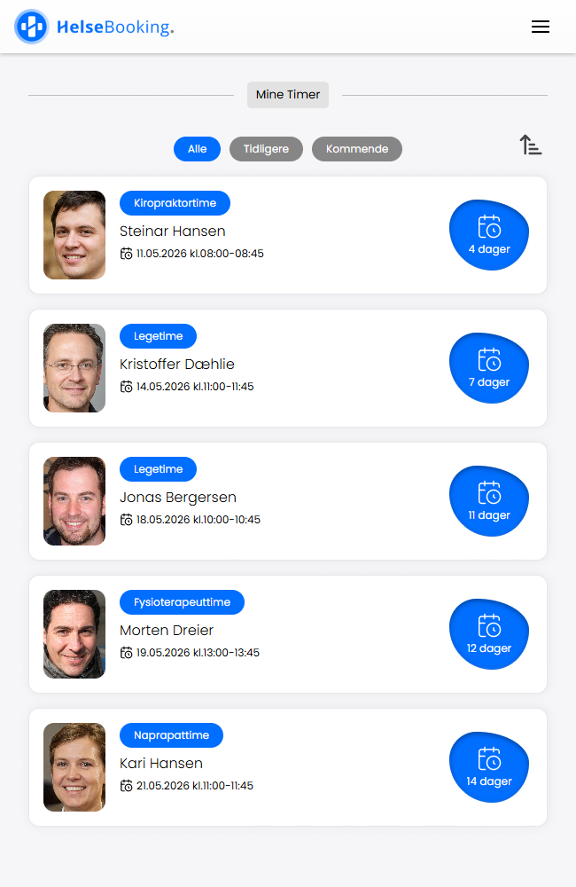
  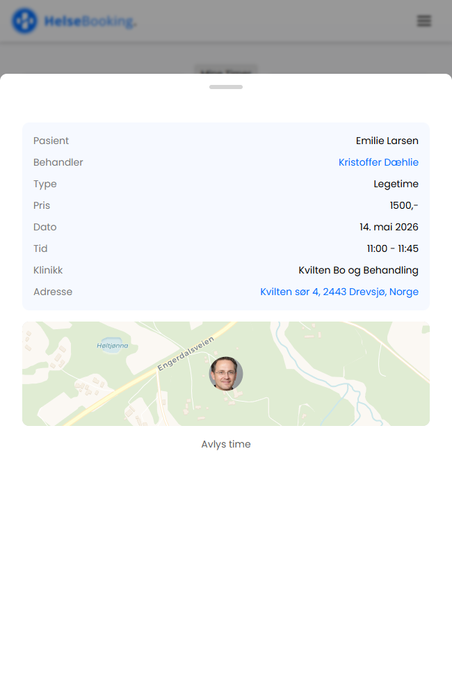
</div>

## 🏥 Klinikker (behandler)
<div>
  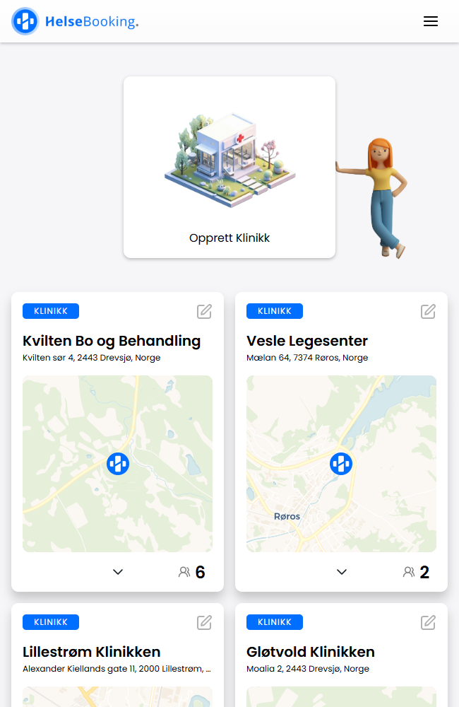
  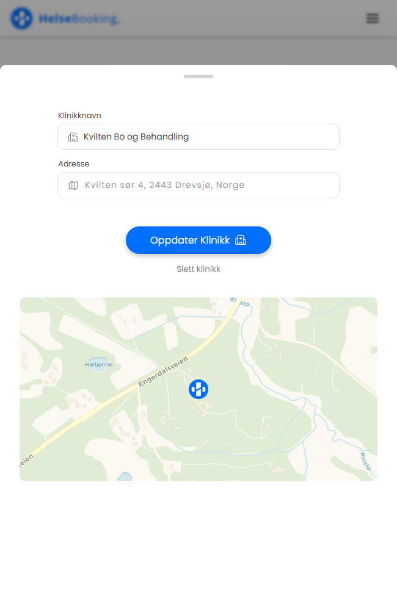
</div>

## 🧑🏻‍⚕️ Min profil (behandler)
<div>
  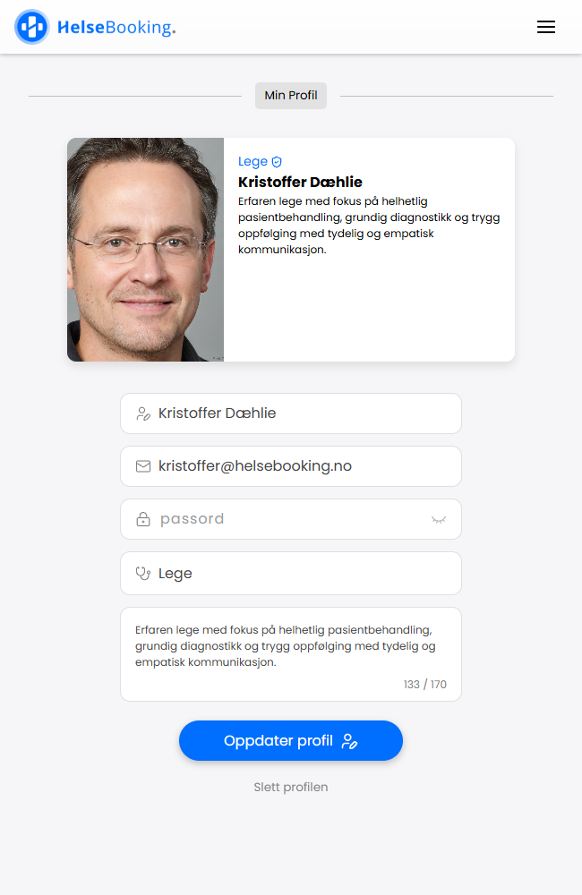
  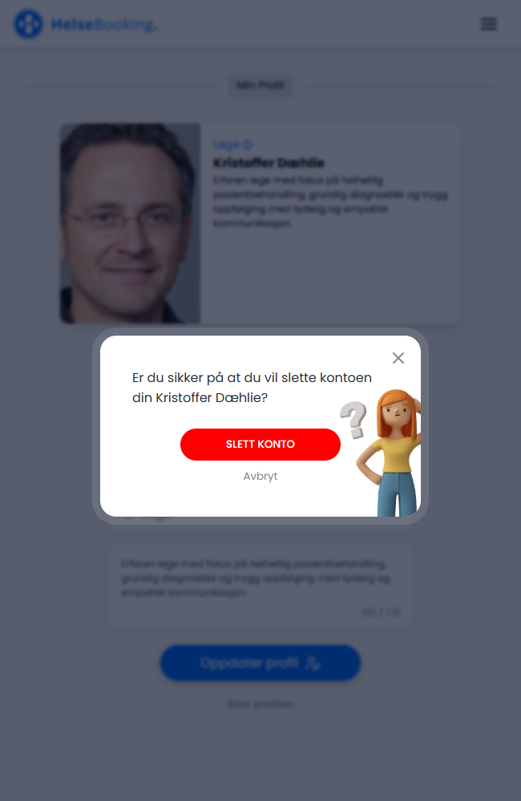
</div>

<br>

# ✏️ Logo design

Jeg har lyst til å vise litt av arbeidsprosessen, noen av utkastene og samtidig få frem tankegangen jeg hadde for å komme frem til HelseBooking logoen. Som du vil se av utkastene under så brukte jeg arbeidsnavnet **Behandler Booking**. Jeg endret navn underveis i utviklingen til **HelseBooking**. Dette ble helt naturlig ettersom appen utviklet seg og arbeidet med logoen gikk videre. I tillegg ble navnet kortere, beholdt forklarende wordmark, men ble mer minneverdig og lettere å bygge en visuell identitet rundt.

## Inspirasjon

Jeg startet med et ønske om en logo som kombinere et ikon med bokstaven B (BehandlerBooking). I min research for å finne inspirasjon fra andre som brukte bokstaven B i logoen så kom jeg over logoen under. Denne bruker bokstaven B på en elegant måte og ble startskuddet for å utforske en egen visuell identitet.

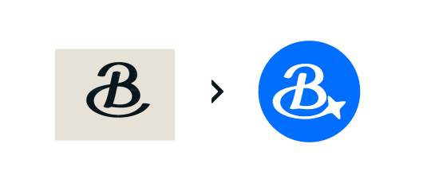

Jeg tok inspirasjonen videre ved å endre logoen til appens farge og legge til et helsekors i enden av B-kurven, som videre ble til en stjerne for bedre flyt. Det var et lite detaljelement som skulle gi logoen personlighet. Dette ble den midlertidige logoen under utviklingen av appen. Denne logoen åpnet døren til fire ulike designretninger.

- **Retning 1** - Bokstaven B i logoen
- **Retning 2** - Et symbolsk **Helse Ikon**
- **Retning 3** - Rename av appen til **Helse.**
- **Retning 4** - Moderne, raskt, enkelt og flat-design


## Retning 1 — Bokstaven B (combination mark)

Den første og naturlige retningen logoen tok var fra startpunktet initialen **bokstaven B for BehandlerBooking**. Jeg utforsket alt fra håndskrevne og lekne varianter til geometriske og minimalistiske tolkninger. Etter hvert begynte noen av variantene å nærme seg helse-symbolikk, og det åpnet døren til neste retning. <br><br>
Et utvalg utkast fra retning 1:

<table align="center">
  <tr>
    <td align="center" width="200">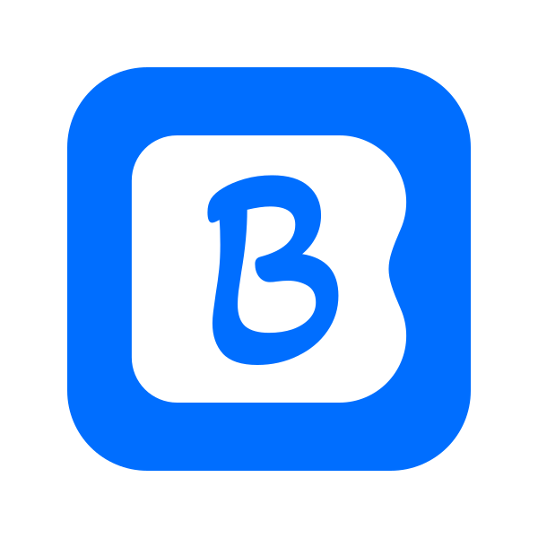</td>
    <td align="center" width="200"></td>
    <td align="center" width="200"></td>
  </tr>
  <tr>
    <td align="center" width="200">B i en B formet hvit bubbly rektangel</td>
    <td align="center" width="200">Negativ B med håndskrevet wordmark</td>
    <td align="center" width="200">To stk B speilet mot hverandre fjernet "rygg".</td>
  </tr>
  <tr>
    <td align="center" width="200"></td>
    <td align="center" width="200"></td>
    <td align="center" width="200"></td>
  </tr>
  <tr>
    <td align="center" width="200">Forrige logo rotert 90 grader, kan se ut som tegneserie øyne.</td>
    <td align="center" width="200">Minimalistisk wordmark med to overlappende blå firkanter</td>
    <td align="center" width="200">Avrundet B-ikon med rotert helsekryss, her begynner det å nærme seg neste retning</td>
  </tr>
</table>

<br>

## Retning 2 — Et symbolsk **Helse Ikon**

Med en helseapp var det naturlig å utforske klassiske helse-symboler som plusstegnet, hjertet og plasteret. Variantene ble organiske og myke, men kanskje noe generiske. Den siste varianten i denne retningen introduserte helsekorset med en skjult H (HelseBooking) i linjene som kutter helsekorset som vi ser igjen i appens logo.

<table align="center">
  <tr>
    <td align="center" width="200"></td>
    <td align="center" width="200">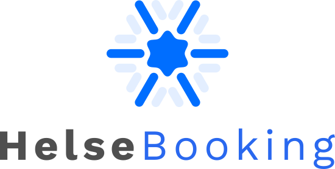</td>
    <td align="center" width="200"></td>
  </tr>
  <tr>
    <td align="center" width="200">Minimalistisk wordmark med lite + over teksten</td>
    <td align="center" width="200">Kryss som eksploderer ut i stråler, nesten som en snøfnugg</td>
    <td align="center" width="200">+ med diagonal bølge som deler mørk og lys blå</td>
  </tr>
  <tr>
    <td align="center" width="200"></td>
    <td align="center" width="200"></td>
    <td align="center" width="200"></td>
  </tr>
  <tr>
    <td align="center" width="200">Symmetrisk kryss omgitt av ellipser, nesten som et kompass</td>
    <td align="center" width="200">Fire overlappende hjerter med gradient</td>
    <td align="center" width="200">Samme hjerte-blomst med wordmark under</td>
  </tr>
  <tr>
    <td align="center" width="200"></td>
  </tr>
  <tr>
    <td align="center" width="200">Symmetrisk kryss omgitt av ellipser, nesten som et kompass</td>
  </tr>
</table>


<br>

## Retning 3 — Rename appen til **Helse.**

Når jeg startet på disse utkastene var utgangspunktet at det skulle være så enkelt og rent som mulig. Jeg vurderte som logoene viser også en rename av appen til å hete kun **Helse.** med et punktum. Inspirert av enkle logoer som VIPPS, men for Helse.

<table align="center">
  <tr>
    <td align="center" width="200"></td>
    <td align="center" width="200"></td>
  </tr>
  <tr>
    <td align="center" width="200">Helse. med avrundet lys boks rundt "e" og punktum</td>
    <td align="center" width="200">Minimalistisk, kun teksten Helse, med grå prikk som punktum</td>
  </tr>
  <tr>
    <td align="center" width="200">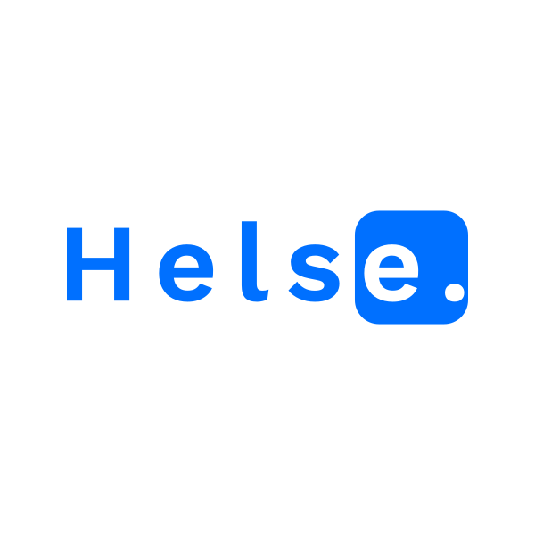</td>
    <td align="center" width="200"></td>
  </tr>
  <tr>
    <td align="center" width="200">"e" og punktum løftet inn i blå avrundet boks</td>
    <td align="center" width="200">Grønn variant med plaster-ikon til venstre for wordmark</td>
  </tr>
</table>

<br>

## Retning 4 — Moderne, raskt, enkelt og flat-design

Fart og effektivitet ble fokuset i denne retningen, booking skal gå raskt. Startpunktet for denne retningen var en geometrisk "flat-design flamme-logo" jeg oppdaget på Dribbble, som viste seg å være logoen appen Fandom på appstore. Formen inspirerte meg til å utforske flamme og meteor (fart), kombinert med symbolikk for helse.

<table align="center">
  <tr>
    <td align="center" width="200"></td>
    <td align="center" width="200"></td>
    <td align="center" width="200">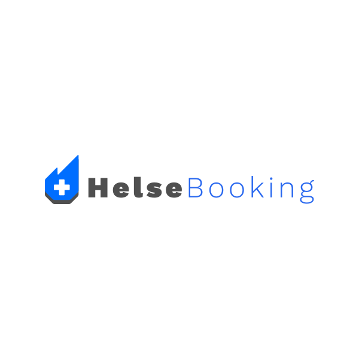</td>
  </tr>
  <tr>
    <td align="center" width="200">Flat-design flamme, helsekors og mørk skygge, iOS FANDOM app-ikon stil</td>
    <td align="center" width="200">Flammen med detaljer bak</td>
    <td align="center" width="200">Ikon + wordmark, første gang HelseBooking dukker opp</td>
  </tr>
  <tr>
    <td align="center" width="200"></td>
    <td align="center" width="200"></td>
    <td align="center" width="200"></td>
  </tr>
  <tr>
    <td align="center" width="200">Meteor i fart, helsekors og ios ish ramme</td>
    <td align="center" width="200">Meteor, helsekors og "Helse." wordmarken</td>
    <td align="center" width="200">Meteor med + i app-ikon, wordmark til høyre</td>
  </tr>
  <tr>
    <td align="center" width="200"></td>
    <td align="center" width="200">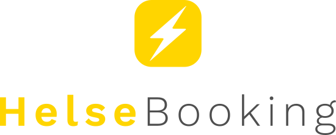</td>
    <td align="center" width="200"></td>
  </tr>
  <tr>
    <td align="center" width="200">Samme meteor med orange flamme-detalj integrert i teksten</td>
    <td align="center" width="200">Gult lynikon i avrundet boks med HelseBooking wordmark</td>
    <td align="center" width="200">Flammen som separator mellom "Behandler" og "Booking"</td>
  </tr>
</table>

<br>

## ✨ Ferdig logo ✨

Logoen jeg endte opp med å bruke er en kombinasjon av de fire retningene logoen har utviklet seg i. Teksten er en redigert versjon av Open Sans Bold/Normal.

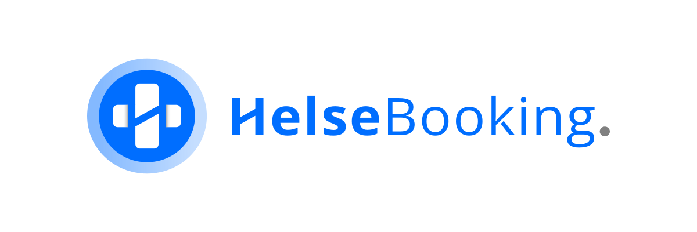

### Bokstaven H er en del av ikonet (retning 1)


### Et helse ikon/symbol (retning 2)


### Punktumet fra "Helse." (retning 3)


## Moderne, men enkelt (retning 4)


<br>

## Hva jeg liker med denne logoen:
- Fungerer som en "Badge" uten teksten
- Flyter godt i navbar og på about siden
- Kan enkelt kombineres med andre UI elementer
- Fungerer i alle størrelser og farger
- Helse symbolikk i logoen
- Beskrivende wordmark
- Bokstaven "H" er bygget inn i bagde/ikon. Stiltrekk fra grafikken er videreført på bokstavene H og K i teksten med skråstreken.

<br>

<table align="center">
  <tr>
    <td align="center">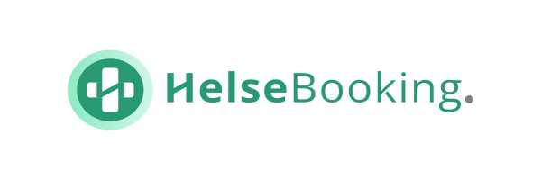</td>
    <td align="center"></td>
  </tr>
  <tr>
    <td align="center">Final versjon grønn</td>
    <td align="center">Final versjon blå</td>
  </tr>
</table>

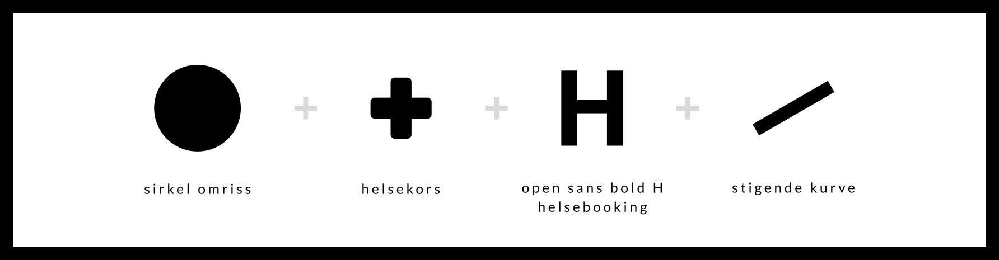

# ✨ Funksjonalitet

**Pasient**
- Registrering og innlogging med JWT-autentisering
- Bla gjennom behandlere med Swiper-karusell
- Se behandlerprofiler med profilbilde, navn og spesialitet
- Booke ledig time med bekreftelsesmodal
- Se og avbestille egne timer med swipe-to-delete animasjon


**Behandler**
- Opprette ledige timer med dato og tidspunkt
- Se oversikt over bookede timer i kalender
- Rollebasert visning – behandlere ser andre verktøy enn pasienter
- Laste opp og slette profilbilde via Cloudinary
- Opprett og rediger klinikker og tilhørende behandlere
- Rediger timer, legg til eller fjern pasienter på timen.


**Generelt**
- Rollebasert tilgangskontroll (pasient / behandler / admin)
- Hindrer at samme time bookes flere ganger
- Det er ikke mulig å booke eller opprette timer tilbake i tid
- Timer blir slettet dersom man fjerner en behandler fra en klinikk
- Timer blir slettet dersom man sletter profilen (pasient/behandler)
- Responsivt design med animert navigasjon

<br>

# Tech Stack

### 💻 Frontend
| Teknologi          | Bruk                           | Begrunnelse                                      |
|---                 |---                             |---                                               |
| React + Vite       | UI-rammeverk og byggverktøy    | Rask utviklingsopplevelse                        |
| React Router v7    | Klientside routing             | Industristandard for React SPA                   |
| Zustand            | Global state management        | Enklere API enn Redux, ingen boilerplate         |
| Framer Motion      | Animasjoner og swipe-to-delete | Animasjon med god React-integrasjon              |
| Swiper             | Karusell for behandleroversikt | Touch-vennlig og mobil-optimalisert              |
| Axios              | HTTP-kall mot API              | Enklere enn fetch og god feilhåndtering          |
| Lucide React       | Ikonbibliotek                  | Fine, lette og konsistente ikoner + treeshakable |
| Leaflet + Geoapify | Kart og adressesøk             | Open source, ingen kostnad og enkel integrasjon  |

### 🗄️ Backend
| Teknologi           | Bruk                            | Begrunnelse                                         |
|---                  |---                              |---                                                  |
| Node.js + Express   | API-server                      | Samme språk som frontend, stort økosystem           |
| MongoDB + Mongoose  | Database og ODM                 | Fleksibel modellering og enkel skalering            |
| JWT + bcryptjs      | Autentisering og passordhashing | Stateless auth, ingen server-side sessions          |
| Cloudinary + Multer | Bildeopplasting og lagring      | CDN-optimalisert bildelagring med transformasjoner  |
| CORS                | Kryssdomene-tilgang             | Nødvendig for separat frontend/backend deploy       |

### ☁️ Deploy
| Tjeneste      | Bruk                                                       | Begrunnelse                           |
|---            |---                                                         |---                                    |
| Render        | Hosting av frontend og backend                             | Gratis tier, enkel GitHub-integrasjon |
| MongoDB Atlas | Skybasert database                                         | Gratis tier, enkel oppsett            |
| Cloudinary    | Bildelagring                                               | Gratis tier med CDN                   |

<br>

# 🏗️ Arkitektur / systemdesign

Dette prosjektet er bygget som et rollebasert bookingsystem der kjernen i systemet er samspillet mellom brukere, klinikker og timeavtaler.

Systemet er designet rundt tre hovedentiteter:

- 🧑‍⚕️ Brukere (User)
- 🏥 Klinikker (Klinikk)
- 📅 Timer (Time)


## 🧑‍⚕️ Brukere og roller

Systemet har tre roller:

- Pasient – kan velge behandler og booke tilgjengelige timer
- Behandler – kan opprette tilgjengelige timer og administrere egne pasienter på sine timer
- Admin – kan administrere systemets struktur (klinikker, brukere og relasjoner) (funksjon kommer)

Brukere lagres i én felles User-modell, der rollen bestemmer tilgangsnivå og funksjonalitet i UI og API.

Behandlere har i tillegg utvidet profil med:

- fagfelt (typeBehandler)
- profilinformasjon
- profilbilde (Cloudinary)

<br>

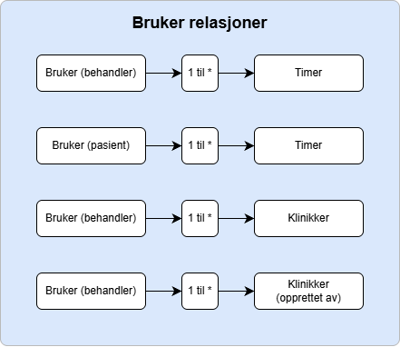

## 🏥 Klinikker som “hub”

Klinikker fungerer som et organisatorisk lag mellom behandlere og timer.

En Klinikk inneholder:

- navn og adresse
- geografiske koordinater (Leaflet/Geoapify)
- liste over tilknyttede behandlere
- eier (opprettetAv)

Dette gjør at én behandler kan tilhøre flere klinikker, og klinikker kan skaleres uavhengig av brukere.

<br>

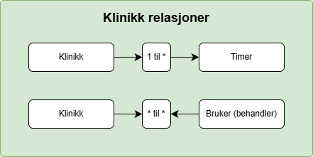

## 📅 Time-modellen (kjerne i systemet)

Time er den mest sentrale entiteten i systemet og binder hele domenet sammen.

En time inneholder:

- behandler (reference til User)
- pasient (valgfri frem til booking)
- klinikk
- dato + start/slutt-tid
- status: ledig | booket | avlyst

Systemet er bygget rundt state transitions:

- ledig → booket (pasient reserverer)
- booket → ledig (avlysning)
- opprettet → tilgjengelig slot fra behandler

Dette gir en tydelig og kontrollert livssyklus for hver time.

<br>

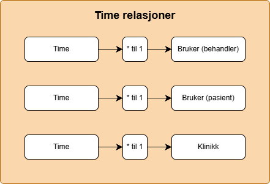

## 🛡️ Backend regler

Backend håndhever all forretningslogikk:

- Overlappende timer blokkeres på server (ingen dobbeltbooking)
- Tid i fortid kan ikke opprettes
- Kun tilgjengelige timer kan bookes
- Avlysning frigjør timer automatisk
- Sletting av klinikk eller bruker rydder relaterte data (cascade-logikk)

## 🔐 Autentisering og tilgang
- JWT brukes for autentisering
- Middleware beskytter private routes
- Rollebasert tilgang styrer:
  - Hvem som kan opprette timer
  - Hvem som kan booke
  - Hvem som kan administrere klinikker

## 🚀 Designvalg
- MongoDB ble valgt for fleksibel modellering av relasjoner
- Mongoose brukes til validering og relasjonslogikk
- Backend håndterer all validering (ikke frontend)
- Frontend er kun presentasjonslag + state management
- API er REST-basert og delt mellom frontend/backend (separat deploy)


## 📁 Mappestruktur:

```
HelseBooking/
├── backend/
│   └── src/
│       ├── controllers/
│       ├── middleware/
│       ├── models/
│       ├── routes/
│       └── server.js
└── frontend/
    └── src/
        ├── components/
        ├── pages/
        ├── store/
        └── main.jsx
```

Frontend og backend er deployet som to separate services på Render og kommuniserer via REST API.

<br>

## Installer appen lokalt

### Forutsetninger
- Node.js
- MongoDB Atlas-konto
- Cloudinary-konto

### Installasjon

```bash
# Klon repoet
git clone https://github.com/patriklie/HelseBooking.git

# Installer backend
cd HelseBooking/backend
npm install

# Installer frontend
cd ../frontend
npm install
```

### Miljøvariabler

Opprett `.env` i `backend/`-mappen:

```
MONGO_URI=din_mongodb_connection_string
JWT_SECRET=din_hemmelige_nøkkel
CLOUDINARY_URL=din_cloudinary_url
PORT=3000
NODE_ENV=development
```

Opprett `.env` i `frontend/`-mappen:

```
VITE_API_URL=http://localhost:3000
VITE_GEOAPIFY_API_KEY=din_geoapify_nøkkel
```

### Start applikasjonen

```bash
# Start backend (fra backend-mappen)
npm run dev

# Start frontend (fra frontend-mappen)
npm run dev
```
<br>

## 👨🏻‍💻 Utvikler

**Patrik Bystrøm Lie**
- GitHub: [@patriklie](https://github.com/patriklie)
- E-post: [patrik.lie@hotmail.com](mailto:patrik.lie@hotmail.com)

<br>

## 👏 Kreditering

Dette prosjektet bruker tredjepartsillustrasjoner og verktøy:

- Freepik – illustrasjoner og 3D assets
- Leaflet – kartvisning
- Geoapify – kartdata

<a href="https://www.magnific.com/free-psd/3d-female-character-with-superhero-cape-launching-into-flight_13678512.htm">Image by freepik</a>